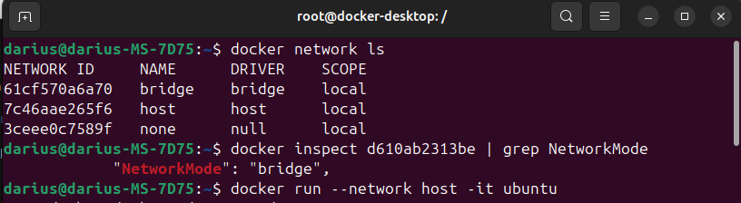

# Docker Linux Tasks for Tremend DevOps Internship

---

## 1. Setup Docker Container
Start by running an Ubuntu container.

```sh
docker run -it ubuntu
```

If you encounter network issues (e.g., no internet access inside the container), try running it with the **host network**:

```sh
docker run --network host -it ubuntu
```


---

## 2. Lookup the Public IP of tremend.com
First, update the package list and install `dnsutils`, then perform an `nslookup` to check the public IP.

```sh
apt update && apt upgrade -y && apt install -y dnsutils
nslookup tremend.com
```


---

## 3. Map IP Address 8.8.8.8 to "google-dns" and Test Connectivity
Add an entry in `/etc/hosts` to map `8.8.8.8` to `google-dns`.

```sh
echo "8.8.8.8 google-dns" >> /etc/hosts
cat /etc/hosts
```


Install `ping` and check connectivity:

```sh
apt-get install -y iputils-ping
ping -c 3 google-dns
```


### Troubleshooting Network Issues


If **ping doesn't work**, check the container's network settings:

```sh
docker network ls
docker inspect <container_id> | grep NetworkMode
```



#### Possible Errors and Fixes

- **If `NetworkMode` is `"none"`**, the container has no network access. Restart docker and create a new container

- **If `NetworkMode` is `"bridge"`** and ping still fails, the firewall might be blocking requests. Try allowing ICMP or switching to host mode:
  ```sh
  docker run --network host -it ubuntu
  ```
  ✅ This grants full network access to the host system.

---

## 4. Check if DNS Port 53 is Open
Install `netcat` and check TCP/UDP connectivity to `google-dns`.

```sh
apt install -y netcat-openbsd
nc -zv google-dns 53 && nc -uzv google-dns 53
```


---

## 5. Change System to Use Google’s Public DNS
Modify `/etc/resolv.conf` to use `8.8.8.8` as the default DNS server.

```sh
echo "nameserver 8.8.8.8" > /etc/resolv.conf
cat /etc/resolv.conf
```


---

## 6. Perform Another Public IP Lookup for tremend.com
Run `nslookup` again to compare results.

```sh
nslookup tremend.com
```


---

## 7. Install and Verify Nginx
Install Nginx and start the service.

```sh
apt install -y nginx
service nginx start
service nginx status
```


---

## 8. Find the Listening Port for Nginx
Check which ports Nginx is listening on:

```sh
ss -tulnp | grep nginx
```


---

## Bonus Tasks

### 1. Change Nginx Listening Port to 8080
Modify the Nginx configuration file.

```sh
apt install -y nano
nano /etc/nginx/sites-available/default
```

- Change:
  ```nginx
  listen 80;
  listen [::]:80;
  ```
  **To**:
  ```nginx
  listen 8080;
  listen [::]:8080;
  ```

Restart Nginx:

```sh
service nginx restart
ss -tulnp | grep nginx
```


---

### 2. Modify the Default HTML Page Title
Replace the default **"Welcome to nginx!"** message.

```sh
sed -i 's/Welcome to nginx!/I have completed the Linux part of the Tremend DevOps internship project/' /var/www/html/index.nginx-debian.html
service nginx restart
```


Install `curl` and verify:

```sh
apt install -y curl
curl http://localhost:8080
```


---