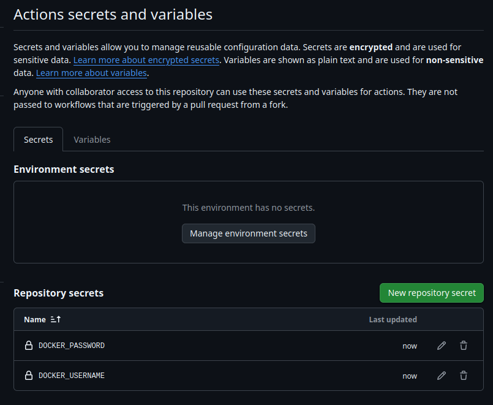

# Flask Calculator App - Docker Instructions

## Local Testing

### 1. Build the Docker Image
```sh
docker build -t flask-calculator .
```

### 2. Run the Docker Container
```sh
docker run -p 8080:8080 flask-calculator
```


### 3. Test the Application
Once the container is running, you can access the application:
- Open a web browser and go to: `http://localhost:8080`


- Use `curl` or Postman to test API calls:

#### Example API call (Addition):
```sh
curl -X POST http://localhost:8080/calculate \
     -H "Content-Type: application/json" \
     -d '{"operation": "add", "numbers": [1,2,3]}'
```
#### Expected Response:
```json
{"result": 6}
```


### 4. Stop the Container
```sh
docker stop <container_id>
```

## Pushing the Image to Docker Hub

### 1. Create a Docker Hub Account
- Sign up at [Docker Hub](https://hub.docker.com/) if you don’t have an account.

### 2. Create a Repository
- Go to **Repositories** > **Create Repository**.
- Name it **flask-calculator**.
- Set it to **public** or **private**.
- Click **Create**.

### 3. Log in to Docker Hub
Run the following command and enter your Docker Hub credentials:
```sh
docker login
```

### 4. Tag the Docker Image
Replace **your_dockerhub_username** with your actual Docker Hub username:
```sh
docker tag flask-calculator your_dockerhub_username/flask-calculator:latest
```

### 5. Push the Docker Image
```sh
docker push your_dockerhub_username/flask-calculator:latest
```


### 6. Verify on Docker Hub
- Go to [Docker Hub](https://hub.docker.com/).
- Navigate to **Repositories** > **flask-calculator**.
- Your image should be listed there.

## Setting Up GitHub Actions Workflow

### 1. Create a GitHub Actions Workflow File
Inside your repository, create a new directory `.github/workflows/` and add a file named `docker-image-ci.yml`.

### 2. Define the Workflow
```yaml
name: Docker Image CI

on:
  push:
    branches:
      - main
      - master

jobs:
  build-and-push:
    runs-on: ubuntu-latest

    steps:
      - name: Checkout Repository
        uses: actions/checkout@v3

      - name: Log in to Docker Hub
        uses: docker/login-action@v2
        with:
          username: ${{ secrets.DOCKER_USERNAME }}
          password: ${{ secrets.DOCKER_PASSWORD }}

      - name: Build Docker Image
        run: |
          cd ex2-docker
          docker build -t ${{ secrets.DOCKER_USERNAME }}/flask-calculator:${{ github.sha }} .

      - name: Push Docker Image to Docker Hub
        run: |
          cd ex2-docker
          docker push ${{ secrets.DOCKER_USERNAME }}/flask-calculator:${{ github.sha }}
```

### 3. Set Up Environment Variables for Docker Hub Login
Go to your GitHub repository and navigate to **Settings** > **Secrets and Variables** > **Actions**:
1. Click **New repository secret**.
2. Add a secret named `DOCKER_USERNAME` with your Docker Hub username.
3. Add a secret named `DOCKER_PASSWORD` with your Docker Hub password.




## Adding Container Stop Check Function
Modify your Flask application to handle container shutdown properly by adding the following function:

```python
import sys
import signal

def handle_shutdown(signum, frame):
    print("Shutting down gracefully...")
    sys.exit(0)

# Catch termination signals
signal.signal(signal.SIGTERM, handle_shutdown)
signal.signal(signal.SIGINT, handle_shutdown)
```
