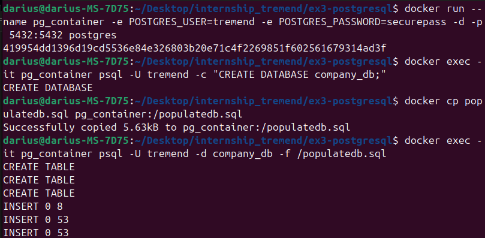
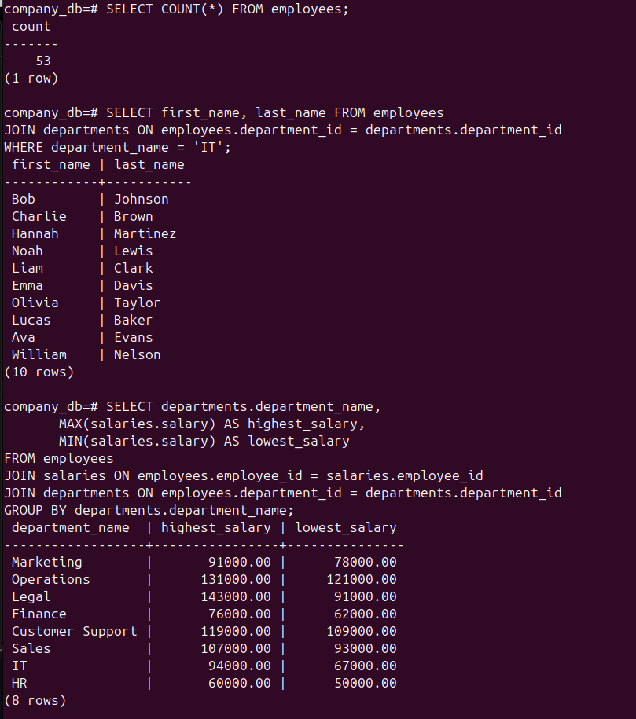
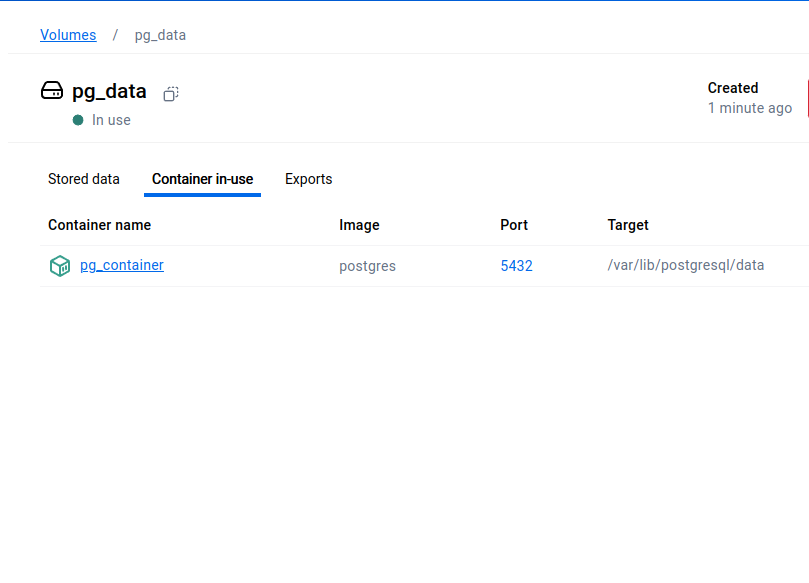

# PostgreSQL Container Setup with Data Import and Queries

## Overview
This project sets up two PostgreSQL database containers, imports data, executes queries, and automates the process using a Bash script.

## Prerequisites
- Docker installed
- `populatedb.sql` file available
- Remove `USE company_db;` from `populatedb.sql`
- Remove final inserts from 54 to 76 from the `salaries` table (invalid entries)

## Steps

### 1. Run the First PostgreSQL Container Manually
```bash
docker run --name pg_container -e POSTGRES_USER=tremend -e POSTGRES_PASSWORD=securepass -d -p 5432:5432 postgres
```

### 2. Create a Database
```bash
docker exec -it pg_container psql -U tremend -c "CREATE DATABASE company_db;"
```

### 3. Import the Dataset
```bash
docker cp populatedb.sql pg_container:/populatedb.sql
docker exec -it pg_container psql -U tremend -d company_db -f /populatedb.sql
```



### 4. Execute Queries
Get inside the PostgreSQL container:
```bash
docker exec -it pg_container psql -U tremend -d company_db
```
#### Total Employees
```sql
SELECT COUNT(*) FROM employees;
```
#### Employees in a Specific Department
```sql
SELECT first_name, last_name FROM employees
JOIN departments ON employees.department_id = departments.department_id
WHERE department_name = 'IT';
```
#### Highest and Lowest Salaries per Department
```sql
SELECT departments.department_name, 
       MAX(salaries.salary) AS highest_salary, 
       MIN(salaries.salary) AS lowest_salary
FROM employees
JOIN salaries ON employees.employee_id = salaries.employee_id
JOIN departments ON employees.department_id = departments.department_id
GROUP BY departments.department_name;
```



After executing queries, exit using:

```sql
\q
```

### 5. Dump the Database
```bash
docker exec -it pg_container pg_dump -U tremend --no-owner -d company_db -Fc -f /company_db_dump.sql
docker cp pg_container:/company_db_dump.sql ./company_db_dump.sql
```

### 6. Automate the Creation of the Second Container with a Bash Script
Create `setup_restore.sh`:
```bash
#!/bin/bash

echo "Starting PostgreSQL Restore Process..."

# Start second container and restore the database
docker run --name pg_container_restore -e POSTGRES_USER=user -e POSTGRES_PASSWORD=securepass -d -p 5433:5432 postgres
sleep 10
docker exec pg_container_restore psql -U user -c "CREATE DATABASE company_db_restore;"

docker exec pg_container_restore psql -U user -d company_db_restore -c "CREATE USER ps_cee WITH SUPERUSER PASSWORD 'adminpass';"

docker cp company_db_dump.sql pg_container_restore:/company_db_dump.sql
docker exec pg_container_restore psql -U ps_cee -d company_db_restore -c "ALTER DATABASE company_db_restore OWNER TO ps_cee;"
docker exec pg_container_restore pg_restore -U ps_cee -d company_db_restore -F c /company_db_dump.sql --no-owner --exit-on-error

# Execute queries on the restored database
mkdir -p logs
echo "Running SQL Queries on the Restored Database..."

docker exec pg_container_restore psql -U ps_cee -d company_db_restore -c "SELECT COUNT(*) FROM employees;" > logs/employee_count.log
echo "Employee count saved to logs/employee_count.log"

echo "Enter department name for query: "
read DEPARTMENT_NAME
docker exec pg_container_restore psql -U ps_cee -d company_db_restore -c "SELECT first_name, last_name FROM employees JOIN departments ON employees.department_id = departments.department_id WHERE department_name = '$DEPARTMENT_NAME';" > logs/employees_query.log
echo "Department query results saved to logs/employees_query.log"

docker exec pg_container_restore psql -U ps_cee -d company_db_restore -c "SELECT departments.department_name, MAX(salaries.salary), MIN(salaries.salary) FROM employees JOIN salaries ON employees.employee_id = salaries.employee_id JOIN departments ON employees.department_id = departments.department_id GROUP BY departments.department_name;" > logs/salary_query.log
echo "Salary query results saved to logs/salary_query.log"

echo "Restore setup complete. Logs saved in logs/"
```
Make it executable and run:
```bash
chmod +x setup_restore.sh
./setup_restore.sh
```

### 7. Persistent Volume (Bonus)
```bash
docker run --name pg_container -e POSTGRES_USER=tremend -e POSTGRES_PASSWORD=securepass -v pg_data:/var/lib/postgresql/data -d -p 5432:5432 postgres
```

